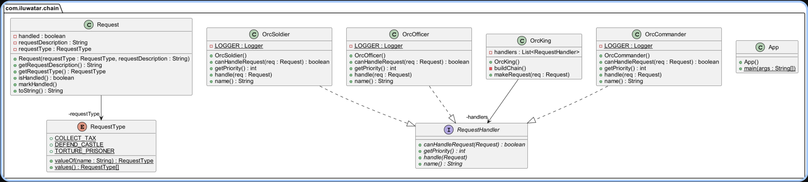

# Chain Of Responsibility Design Pattern

## Examples

### Logger

#### Structure

#### Components
Abstract Handler
 * The Handler interface declares a method for building the chain of handlers.
 * It also declares a method for executing a request.

Concrete Handler
 * All Concrete Handlers either handle a request or pass it to the next handler in the chain.
 * Concrete Handlers contain the actual code for processing requests. Upon receiving a request, each handler must decide whether to process it and, additionally, whether to pass it along the chain.
 * Handlers are usually self-contained and immutable, accepting all necessary data just once via the constructor.

#### Flow
1. Initialise all objects that need to be a part of the chain
2. Create a chain using the setNext function
3. Call any of the objects with the level value to trigger the functions from any of the valid objects in the sequence

## UML Example

## References
1. https://refactoring.guru/design-patterns/chain-of-responsibility
2. https://www.geeksforgeeks.org/chain-responsibility-design-pattern/?ref=lbp