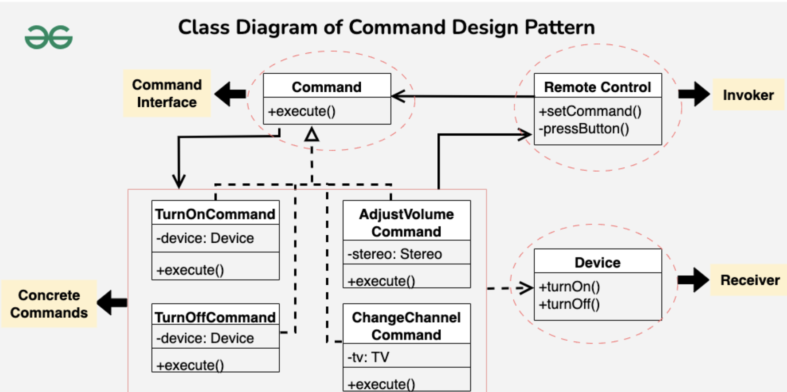

# Command Design Pattern


## Examples

### Remote Control

#### Structure
```
├── command
│   └── command.h
├── invoker
│   └── invoker.h
├── main.cpp
└── receiver
    └── receiver.h
```

#### Components
1. Receiver Interface: Specifies a standard set of methods to be followed by all concrete receivers

2. Receiver Concrete: The Receiver class contains some business logic. Almost any object may act as a receiver. Most commands only handle the details of how a request is passed to the receiver, while the receiver itself does the actual work.

3. Command Interface: The Command interface usually declares just a single method for executing the command.

4. Command Concrete: Concrete Commands implement various kinds of requests. A concrete command isn’t supposed to perform the work on its own, but rather to pass the call to one of the business logic objects. However, for the sake of simplifying the code, these classes can be merged.

5. Invoker: The Sender class (aka invoker) is responsible for initiating requests. This class must have a field for storing a reference to a command object. The sender triggers that command instead of sending the request directly to the receiver. Note that the sender isn’t responsible for creating the command object. Usually, it gets a pre-created command from the client via the constructor.


#### Flow
1. Client creates a receiver pointer and references it to a receiver device
2. Client creates a remote object
3. Client creates commands with the receiver pointer
4. Client uses those commands using the remote object


## UML Example


## References
1. https://www.geeksforgeeks.org/command-pattern/?ref=lbp
2. https://refactoring.guru/design-patterns/command