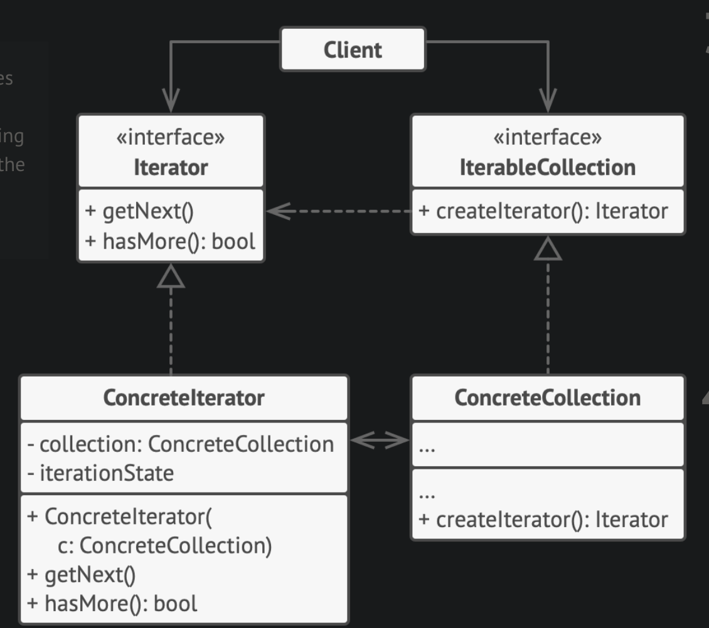

# Iterator Design Pattern

## Examples

### Organisation

#### Structure
```
├── collection
│   └── collection.h
├── iterator
│   └── iterator.h
├── main.cpp
└── object
    └── object.h
```

#### Components
Iterator Interface
- defines a common interface to be followed
- contains generic methods such as hasNext and next

Concrete Iterator
- an implementation of the interface
- contains a copy or pointer to the data being referred / accessed / traversed (aggregation)

Collection Interface
- an interface for an aggregate object, could be made up of different / complex data structures
- contains multiple create iterator methods

Concrete Collection
- an implementation of the interface
- contains 1 or more create iterator methods which returns the iterator interface pointer to the client (association)

#### Flow
1. Client creates a collection as needed
2. Client calls the collection object's get iterator method when it needs to traverse the data
3. Client uses the iterator's hasNext and Next to traverse over the data stored in their collection


## UML Example


## References
1. https://refactoring.guru/design-patterns/iterator
2. https://java-design-patterns.com/patterns/iterator/#programmatic-example-of-iterator-pattern-in-java