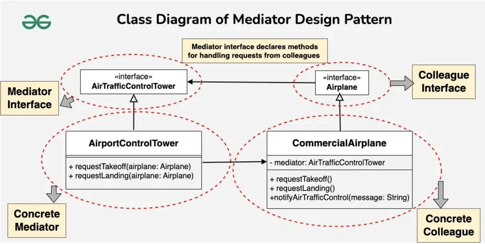

# Mediator Design Pattern

## Examples

### Air Traffic

#### Structure
```
├── colleague
│   ├── colleague.h
│   └── interface.h  ---> Dependency Inversion Principle to avoid circular dependency
├── main.cpp
└── mediator
    └── mediator.h
```

#### Components
1. Mediatior Interface: The Mediator interface declares a method used by components to notify the mediator about various events. The Mediator may react to these events and pass the execution to other components.

2. Mediator Concrete: Concrete Mediators implement cooperative behavior by coordinating several components. Contains the colleagues / components

3. Colleague / Component: The Base Component provides the basic functionality of storing a mediator's instance inside component objects. 

4. Concrete Component: Concrete Components implement various functionality. They don't depend on other components. They also don't depend on any concrete mediator classes.

#### Flow
1. Client creates a mediator
2. Client creates the components with the help of the mediator
3. Client communicates amongst the components via the mediator

## UML Example


## References
1. https://refactoring.guru/design-patterns/mediator
2. https://www.geeksforgeeks.org/mediator-design-pattern/?ref=lbp