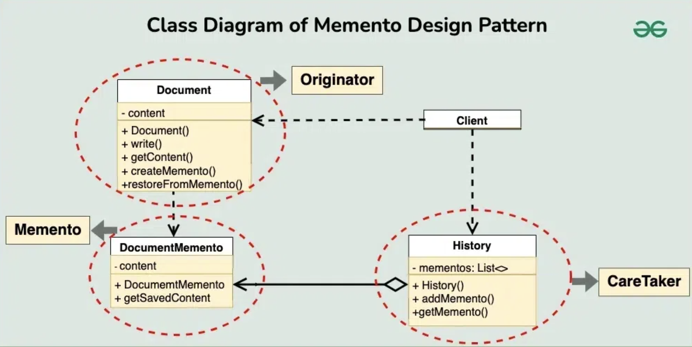

# Memento Design Pattern

## Examples

### 

#### Structure

#### Components
1. Memento: Immutable objects that contain / encapsulates a specific state of the originator

2. Originator: A creator who's state can be saved at anytime in the form mementos and restored when needed

3. Caretaker: Manages the lifecycle of mementos though it cannot access the contents and keeps track of them 

4. Client: Contains an object of the originator which performs the actual work and the caretaker which manages the lifecycles of the originator - save state or restore state

#### Flow
1. Client creates an originator
2. Client uses the originator to create the caretaker
3. Originator performs it usual work time to time
4. Caretaker uses its functionality to save and restore originator state as and when required

## UML Example

## References
1. https://www.geeksforgeeks.org/memento-design-pattern/?ref=lbp
2. https://refactoring.guru/design-patterns/memento