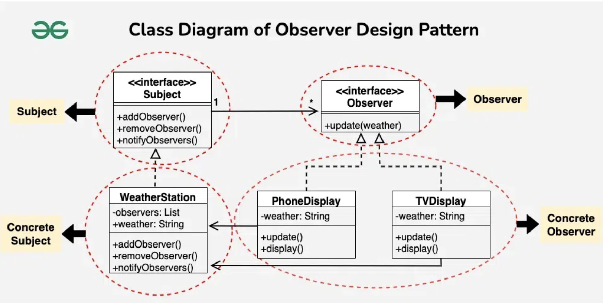

# Observer Design Pattern

## Examples

### Weather Station

#### Structure
```
├── main.cpp
├── observer
│   └── observer.h
└── subject
    ├── subject.cpp
    └── subject.h
```

#### Components

##### Subject Interface
An interface which contains pure virtual funtions
- publish
- subscribe
- unsubscribe
- setstate

Files
- subject.h -> class definition and function declarations
- subject.cpp -> function definitions

##### Subject Concrete
Implementation of above interface and a list of obervers (type `oberver interface pointer`)

Files
- subject.h -> class definition and function declarations
- subject.cpp -> function definitions

##### Observer Interface
An interface which contains pure virtual funtions
- update
- businesslogic

##### Observer Concrete
Implementation of above interface

Files
- observer.h

#### Flow

1. main.cpp acts as the main server of the event management / publisher-subscriber system
2. Server creates a pointer of the Subject interface and initialises it with a subject concrete class of their choice
3. Initialises pointer objects of the oberser interface referencing the concrete observers
4. Add observers to the subject
5. Push a state change and observe the behaviors of each individual observers

#### UML Example



## References
1. https://www.geeksforgeeks.org/observer-pattern-set-1-introduction/?ref=lbp
2. https://refactoring.guru/design-patterns/observer
3. https://refactoring.guru/design-patterns/observer/cpp/example