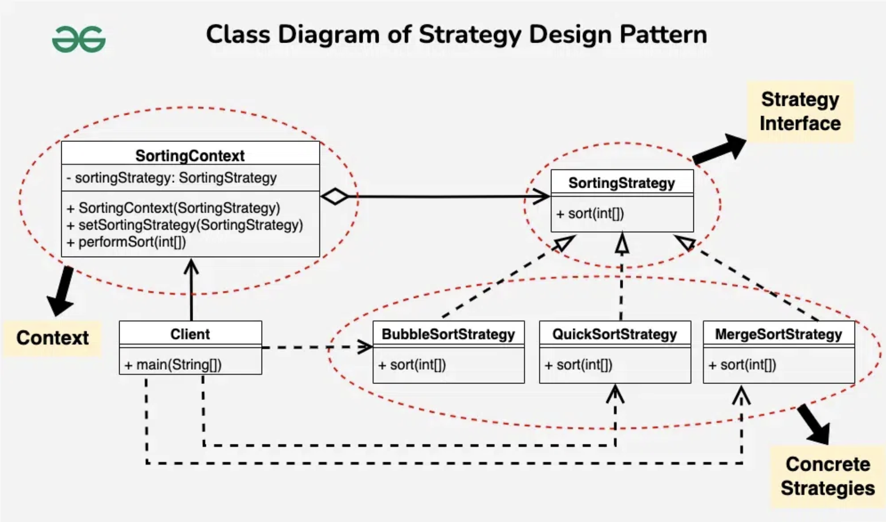

# Strategy Design Pattern

## Examples

### Sorting

#### Structure:
```
├── main.cpp
└── strategy
    ├── context.cpp
    ├── context.h
    ├── sorting.cpp
    └── sorting.h
```

##### Client 
- main.cpp

##### Context 
- context.cpp - Function definitions
- context.h - Class definition and function declarations

##### Strategy
- sorting.h
    - Strategy Interface definition
    - Bubble, Merge, Selection Sort Strategy Concrete Classes
- sorting.cpp
    - Member Function definitions

#### Flow

1. Client is aware of our sorting strategies - Selection, Merge and Bubble
2. Client is aware about the sorting context - an interface provided between them and the strategies available
3. Client initialises the context to their preferred strategy and uses it as per their requirements
4. Client can switch to other strategies as well through the same context, since strategy objects are available to them.

#### UML Example



## References

1. https://staffwww.fullcoll.edu/aclifton/cs123/lecture-projects-and-files.html
2. https://www.geeksforgeeks.org/strategy-pattern-set-1/?ref=lbp
3. https://www.geeksforgeeks.org/strategy-pattern-set-2/
4. https://refactoring.guru/design-patterns/strategy