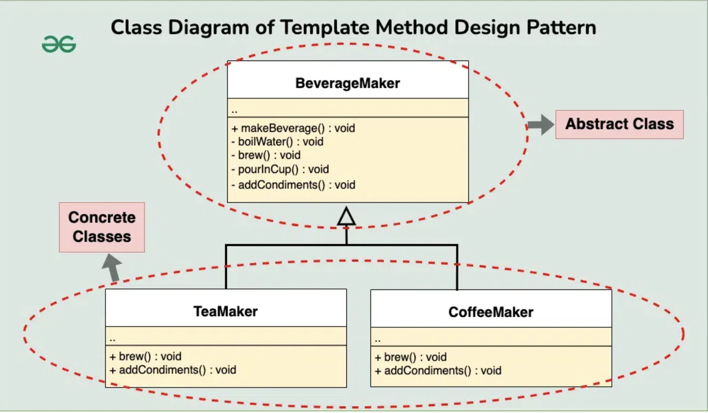

# Template Method Design Pattern
(Locked class and Method)?

## Examples

### Beverages

#### Structure
```
├── beverages.h
└── main.cpp
```

#### Component
##### Abstract Class
The Abstract Class defines a template method that contains a skeleton of some
algorithm, composed of calls to (usually) abstract primitive operations.
*
Concrete subclasses should implement these operations, but leave the template
method itself intact.

##### Template Method
- The template method defines the skeleton of an algorithm.
- Fixed sequence of steps, each calling a member function
- Subclasses can alter implementations of these methods

##### Hook Methods
These are "hooks." Subclasses may override them, but it's not mandatory
since the hooks already have default (but empty) implementation. Hooks
provide additional extension points in some crucial places of the
algorithm.

##### Concrete Child Class
Concrete classes have to implement all abstract operations of the base class.
They can also override some operations with a default implementation.


#### Flow
1. Driver creates an abstract class pointer and references it to the concrete object
2. Client uses the pointer to call the main template method


## UML Example


## References
1. https://www.geeksforgeeks.org/template-method-design-pattern/?ref=lbp
2. https://refactoring.guru/design-patterns/template-method