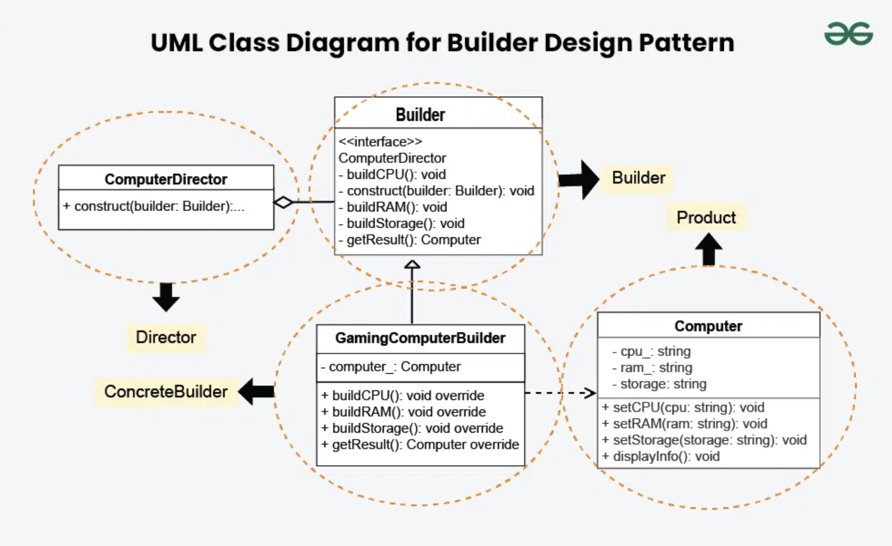

# Builder Design Pattern

## Examples

### Car

#### Structure
```
├── builder
│   └── builder.h
├── director
│   └── director.h
├── main.cpp
└── product
    └── product.h
```

#### Components

##### Builder
Provides a common interface to be followed by all concrete builders

##### Concrete Builder
Each concrete builder offers a variation in the actual product object created

##### Director
Director contains a builder object and has methods for calling builder methods defined in a particular sequence

##### Product
Concrete class of a specific component, service etc

#### Flow
1. Client creates a pointer variable of Builder and references it to the object of a concrete builder of their choice
2. Client uses the builder pointer to create an object of the director concrete class
3. Client uses the director object to call the sequenced building methods
4. Client uses the builder to fetch the built product object
5. Client uses the product object


## UML Example



## References
1. https://refactoring.guru/design-patterns/builder
2. https://www.geeksforgeeks.org/builder-design-pattern/?ref=lbp