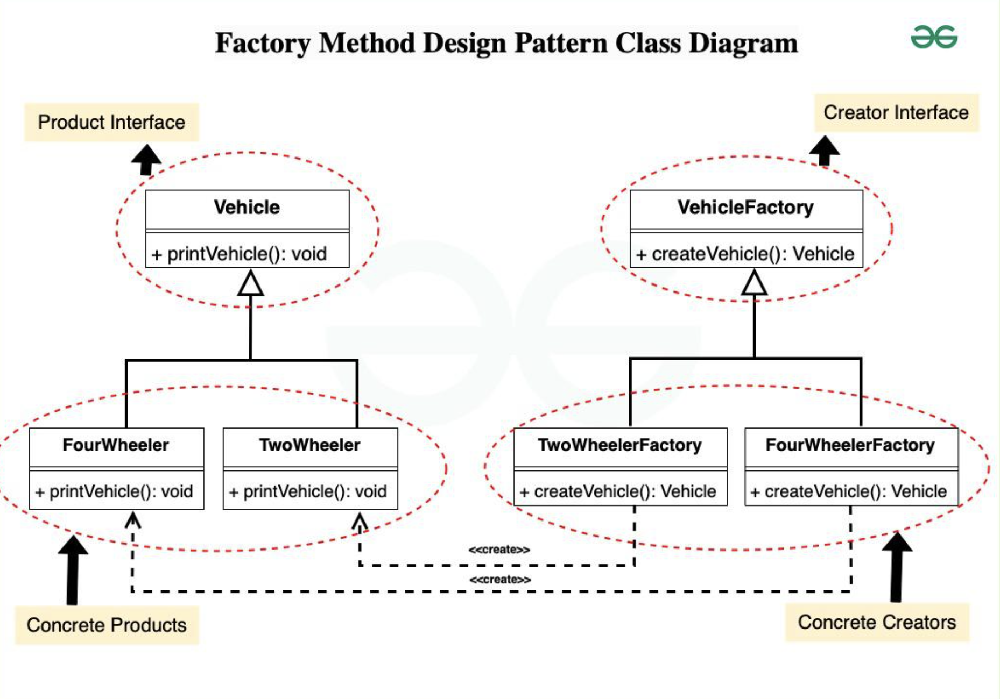

# Factory Design Pattern

## Examples

### Transport

#### Structure
```
├── creator
│   └── creator.h
├── main.cpp
└── product
    └── product.h
```

#### Components
##### Creator Interface
An interface / abstract class of the factory

Has a method to create an object of the conrete product's class

##### Creator Concrete
Implementation of the above interface

Each creator corressponds to a product

#### Product Interface
An interface / abstract class of the Product

#### Product Concrete
Implementation of the above interface and the methods

#### Flow
1. Client creates a pointer of type Creator Interface and references it the Product factory class object which they need
2. Client uses this creator pointer to now initialise an object of the product with all their customisations and specifications
3. The initialised object is also a pointer of the Product Interface type and references the Concrete Product object which client used


#### UML Example


## References
1. https://www.geeksforgeeks.org/factory-method-for-designing-pattern/?ref=lbp
2. https://refactoring.guru/design-patterns/factory-method