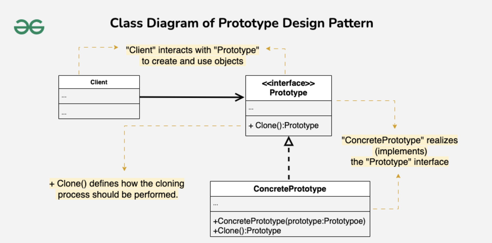

# Prototype Design Pattern

## Examples

### Shapes
#### Structure
```
├── main.cpp
└── prototypes
    └── prototypes.h
```

#### Components

##### Prototype Interface
A common interface for multiple similar concrete functionality with a clone method

##### Prototype Concrete
An implementation of the above interface

#### Flow
1. Driver creates a pointer of type prototype interface and references it to a new object of the concrete class
2. This pointer is passed to the client
3. Client uses this prototype pointer to call the clone method and make copies of the original concrete class object


## UML Example



## References
1. https://refactoring.guru/design-patterns/prototype
2. https://www.geeksforgeeks.org/prototype-design-pattern/?ref=lbp