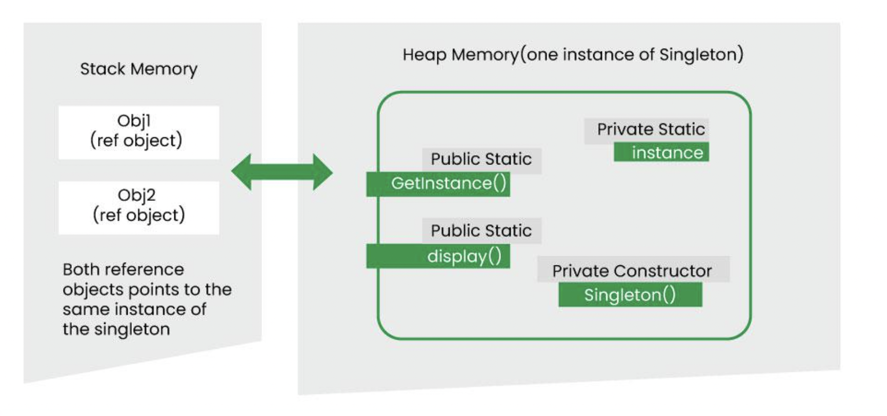

# Singleton Design Pattern

## Concepts
- Static Data Member
- Static Member Function
- Private Constructor
- Lazy / Eager Initialisation
- Thread Safety

## UML Example

## References
1. https://refactoring.guru/design-patterns/singleton
2. https://www.geeksforgeeks.org/singleton-design-pattern/?ref=lbp
3. https://www.geeksforgeeks.org/static-member-function-in-cpp/
