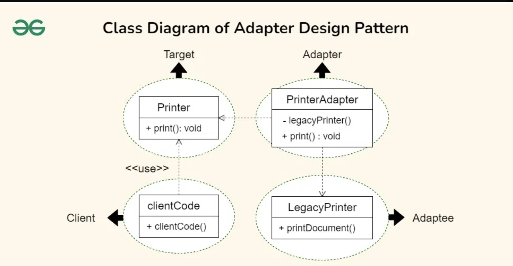

# Adapter Design Pattern

## Examples

### Converter

#### Structure
```
├── adaptee
│   └── adaptee.h
├── main.cpp
└── target
    └── target.h
```

#### Components

##### Adaptee
The class (abstract or concrete) which is incompatible with the client

##### Target Interface
An interface which is compatible with the client and acts as a bridge between client and adaptee

##### Adapter
An implementation of the target interface

Contains an object of the adaptee (aggregation) which is used to call the real methods post compatibility processing

#### Flow
1. Driver creates an adapter object
2. Driver creates a Target interface pointer and references it to a new concrete adapter
3. Target object is passed to the client
4. Client uses it to interact with the incompatible adaptee class

#### UML Example



## References
1. https://www.geeksforgeeks.org/adapter-pattern/?ref=lbp
2. https://refactoring.guru/design-patterns/adapter