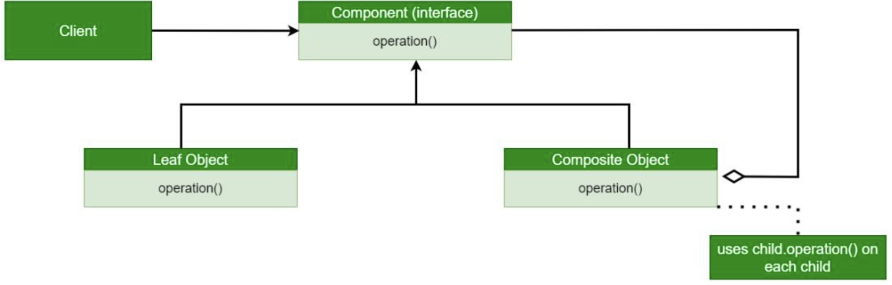

# Composite Design Pattern

## Examples

### FileSystem

#### Structure
```
├── component
│   └── component.h
├── composite
│   └── composite.h
├── leaf
│   └── leaf.h
└── main.cpp
```

#### Components

##### Compoenent Interface
- Common interface for both the leaf and the composite
- Contains a set of common operations

##### Leaf Concrete
- Implements the component interface
- Leaf Node of the tree

##### Composite Concrete
The Composite class represents the complex components that may have children.
Usually, the Composite objects delegate the actual work to their children and
then "sum-up" the result.

Consider the Composite object as a tree node with
- leaves as children
- other nodes as children

#### Flow
1. Create a component interface pointer
2. Reference the pointer variable to a concrete implementation such as composite or leaf class
3. Build the composite object further with other composite objects (referenced to parent component interface)
4. Pass this component pointer to client


## UML Example


## References
1. https://refactoring.guru/design-patterns/composite
2. https://www.geeksforgeeks.org/composite-method-software-design-pattern/?ref=lbp