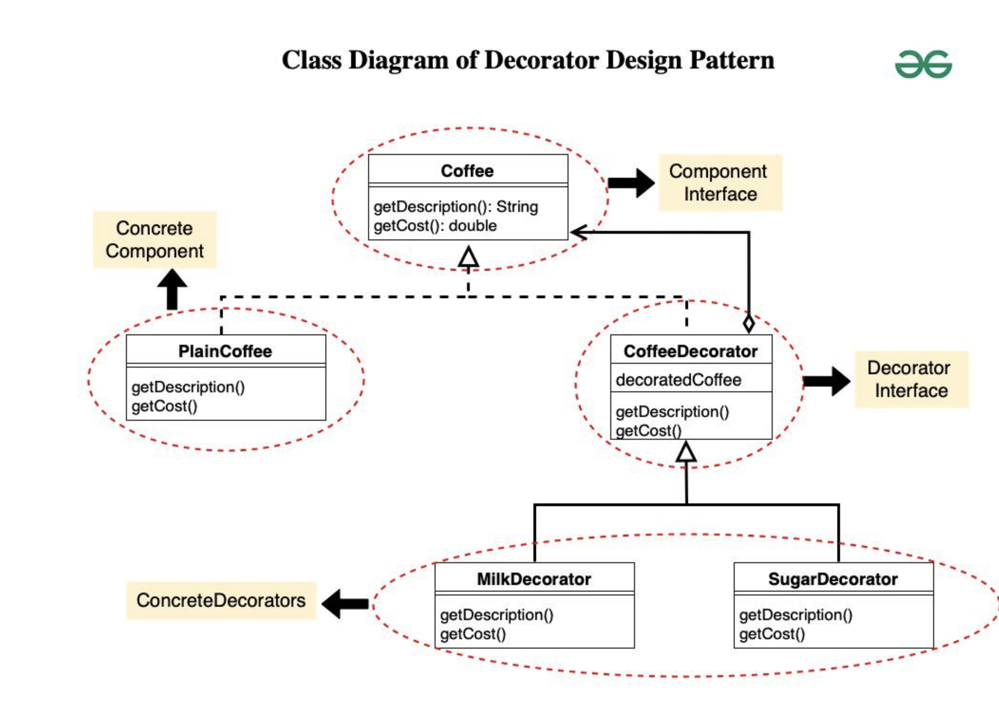

# Decorator Design Pattern

## Examples

### FileSource

#### Structure
```
├── component
│   ├── component.cpp
│   └── component.h
├── decorators
│   └── decorator.h
└── main.cpp
```

#### Components
##### Component Interface
An interface representing the base product. For the FileSource example, this will have pure virtual methods such as
- read
- write

##### Component Concrete
A Concrete class implementing the above interface's pure virtual functions
with some additional private datamembers

##### Decorator Abstract / Concrete
A base class for all decorators
- Extends the Component Interface to be inline with the other Concrete Components
- Maintains an object of the concrete component to ensure an aggregation

```
base = new BaseComponent();
decoratebase1 = new Decorate1(base);
decoratebase2 = new Decorate2(decoratebase2);

decorators are being wrapped over the existing underlying objects using the aggregation relationship
```

##### Decorator Concrete
Adds additional functionily or manipulations to the existing object
Uses the object to call the original member functions after or before making its alterations

#### Flow
1. Client uses the IComponent class to create a pointer to the FileComponent class instance
2. Client uses the decorator to wrap this pointer variable and initialise a new reference
3. Client performs the same step with other decorators
4. Client uses the outermost decorator variable to call all of the intended methods of the component


#### UML Example



## References
1. https://www.geeksforgeeks.org/decorator-pattern/?ref=lbp
2. https://refactoring.guru/design-patterns/decorator