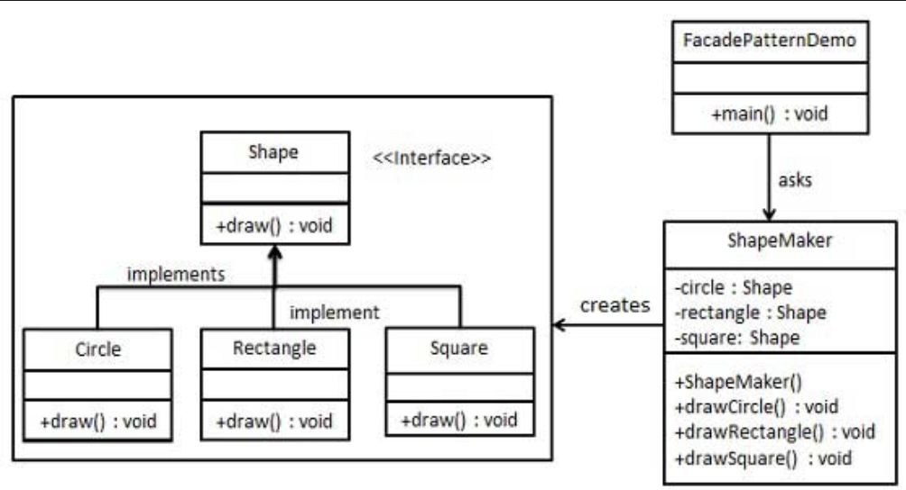

# Facade Design Pattern

## Examples

### Mine

#### Components

##### Mine Worker Interface
- A common interface for each mine worker
- has a common set of methods - pure virtual and virtual

##### Mine Worker Concrete
- Different implementations of the above worker interface
- May have class methods specify to this concrete class
- Tunnel Worker, Gold Worker

##### Mine Machine Interface
- A common interface for each mine machine

##### Mine Machine Concrete
- Different implementations of the above interface
- Tunnel Machine, Gold Extractor Machine

##### Mine Facade Interface
- A high level facade layer to encapsulate complexities of the mine sub-system
- Has a pre-defined functionality to extract from the sub-system
- Contains an object of each class from sub-system it interacts  

##### Client
Uses the methods as made available by the facade

#### Flow
1. The driver creates the subsystem
2. Three worker pointers are created, each referencing a specific concrete worker object
3. Facade pointer is initialised and references the concrete facade object
4. Facade pointer is passed to the client
5. Client makes use of the methods defined inside the facade 

## UML Example

## References
1. https://github.com/iluwatar/java-design-patterns/blob/master/facade/README.md
2. https://refactoring.guru/design-patterns/facade
3. https://www.geeksforgeeks.org/facade-design-pattern-introduction/?ref=lbp