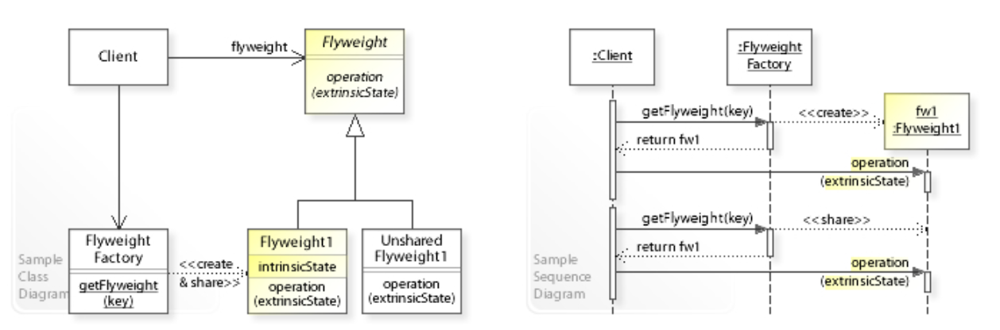

# Flyweight Pattern

## Examples

### Forest

#### Structure
```
├── forest.h
├── main.cpp
├── tree
│   └── tree.h
└── treeflyweight
    ├── factory.h
    └── flyweight.h
```

#### Components

1. Flyweight Interface
2. TreeType Concrete Class - Implementation of the flyweight interface, contains the intrinsic data members of the product
3. Tree Concrete Class - Implementation of the flyweight interface, contains the flyweight object and method implementations including one or more methods having the extrinsic members as paramters
4. Flyweight Factory Interface
5. TreeType Factory - Implementation of the above interface, contains a cache of flyweight pointers based on a key and creates new flyweight objects using the concrete TreeType class
6. Forest Concrete Class - Has a list of Tree Concrete Class pointers and the Flyweight factory pointers

#### Flow
1. Create a Flyweight factory pointer and reference it to a new TreeType Flyweight Factory Concrete class object
2. Initialise the forest pointer with the above factory
3. Add trees to the forest
4. Call the forest methods


## UML Example


## References
1. https://refactoring.guru/design-patterns/flyweight
2. https://www.geeksforgeeks.org/flyweight-design-pattern/?ref=lbp