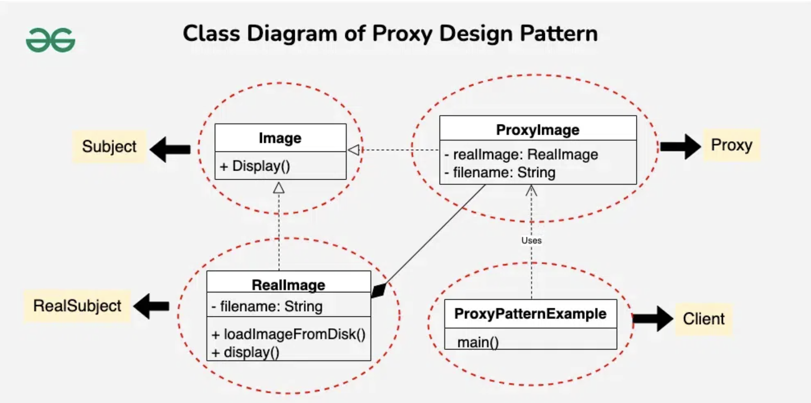

# Proxy Design Pattern

## Examples

### Library

#### Structure
```
├── main.cpp
├── proxy
│   └── proxy.h
└── subject
    └── subject.h
```

#### Components

##### Subject Interface

An interface or abstract class representing a set of method for our subject or product or service

##### Concrete Subject

Actual implementation of the interface

##### Concrete Proxy 

- Implementation of the subject interface
- Can be used using a base class pointer and passed to the client along side the concrete class's referenced object
- Contains an instance of Subject interface itself (aggregation)
- Similar to decorator, calls the real object at the proxy concrete class's functions

#### Flow

1. Create a concrete subject object as a reference to the base interface pointer
2. Create a proxy concrete object using the above concrete subject object as a reference to the base interface pointer
3. Pass the proxy pointer to the client code
4. Client calls the methods of proxy pointer, which in turn calls the methods of the actual object

#### UML Example


## References
1. https://refactoring.guru/design-patterns/proxy
2. https://www.geeksforgeeks.org/proxy-design-pattern/?ref=lbp